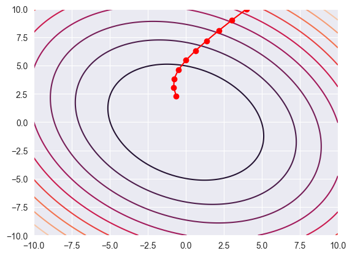

# 問題
ディープラーニングの最適化手法としてよく用いられるAdamを実装してみましょう。
この問題では以下の定義式を採用します。 
損失関数を $L(\bm{w})$として、
$$
\begin{align}
    \bm{w}^{(t+1)} & = \bm{w}^{(t)} + \Delta\bm{w}^{(t)} \\

    \Delta\bm{w}^{(t)}_i &= -\alpha \frac{\hat{m}_{i, t}}{\sqrt{\hat{v}_{i,t}}+\epsilon} \\

   m_{i, t} &= \beta_1 m_{i, t-1} + (1 - \beta_1 ) \nabla L(\bm{w}^{(t)})_i\ \\

   v_{i, t} &=  \beta_2 v_{i, t-1} + (1 - \beta_2) \{\nabla L(\bm{w}^{(t)})_i\}^2 \\

   \hat{m}_{i, t} &= \displaystyle\frac{m_{i, t}}{1-\beta_1^t} \\

   \hat{v}_{i, t} &= \displaystyle\frac{v_{i, t}}{1-\beta_2^t} 

\end{align}
$$
更新の流れを説明します。まず、式(1)に注目してください。この式は、 $t$ ステップ目では差分 $\Delta\bm{w}^{(t)}$ でパラメータを更新すると述べています。
パラメータ $\bm{w}$ はベクトルであることに注意してください。 $\bm{w}_i$ で第 $i$ 成分を表します。(2) から (5) でこの差分を求めていきます。

次に (3)に注目してください。$m_{i, t}$ はほぼ最近の勾配の和です。なぜ和をとるか簡単説明すると勾配が小さい領域が広い場合、勾配の値が小さくSGDではこの領域を抜けるのにとても時間がかかってしまいます。そこで和をとって同じ方向に小さい勾配が向く領域では次第に加速され素早く抜けることができます。またSGDで見られる更新のばたつきを抑えることができます。(**TODO**図をつける)

書きかけ！！！

　ただし、 $m_{i, t}$ の初期値は $0$ で始めるため最適化開始直後は小さい値になってしまいます。そこで
正確には 近似的に $m_{i, t}$ が勾配の一次モーメントになるように調整しています。詳しくは [1]もしくは原論文[2]を参照してください。

<figure>
    
    <figcaption> Adamによる更新の様子[3] </figcaption>
</figure>

以下の関数の最小値をAdamで探索してみましょう。
$$
L(\bm{w}) = L(x, y) = 0.26(x^ 2 + y^2)  - 0.48 xy
$$
初期値 $(x_0, y_0)$ と整数 $N$ が与えられるので $N$ 回更新したときの値を求めてださい。勾配は数値微分(中心差分、`h = 1e-5`)で求めてください。

# 制約
- $1 \leq N  \leq 10^6$
- $-10 < x_0  < 10$
- $-10 < y_0  < 10$

# 入力
$N$ 
$x_0, y_0$

# 出力
$N$ 回更新したときの $x, y$ の値を出力してください。

想定解との絶対誤差または相対誤差が $10^{-5}$ 以下であれば正解とします。
# 出典
[1]瀧雅人 『これならわかる深層学習入門』
https://www.kspub.co.jp/book/detail/1538283.html

[2]https://arxiv.org/pdf/1412.6980

[3] matplotlib, seabornを用いて作成した。
