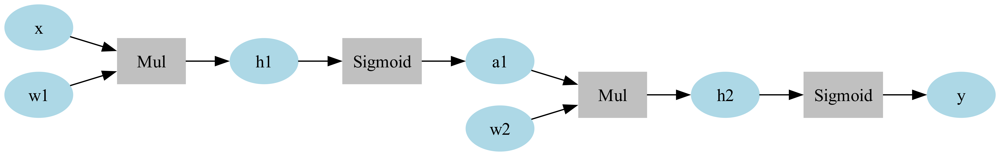

# 問題文
簡単な自動微分を実装してみましょう。
この問題では次のニューラルネットを実装します。

<figure>
    
    <figcaption>　今回作成するNNの計算グラフ </figcaption>
</figure>

問題文の最後に自動微分のプログラムが掲載されていますが、`Variable`クラスの`backward()`及び`Sigmoid`クラス定義が空欄になっています。この部分を実装して`AC`するようにしてください。
プログラムについて簡単に解説します。
- `Variableクラス`
誤差を逆伝播する際に、入力の値をとっておく必要があります。例えば $f(x) = x^2$ という関数の微分を求めるのに $f'(x) = 2x$ と入力 $x$ の値が必要です。
また、誤差を出力側から逆伝播するので各変数が勾配を保持する必要があります。そこでこれらをまとめて `numpy.ndarray` に皮を被せたクラス`Variable`を定義します。
`data`が値を、`grad`が勾配を保持するメンバ変数です。例えば`data`や`grad`には`numpy.array([1.0, 2.0, 3.0])`のような値が保持されます。`creator`はその`Variable`を出力した関数です。例えば、上図で`y`の`creator`は`Sigmoid`です。

- `Functionクラス`
誤差逆伝播を統一的に行うため、計算グラフに出てくる関数の基底クラスとして`Function`クラスを実装します。
`Function`クラスを継承したクラスのインスタンスは関数のように呼び出すことができます。
  （例）
```python
import numpy as np
class Exp(Function):
    def forward(self, x):
        # xはVariableではなく、その中身のdata(Numpy.array型)
        # 計算して Numpy.array型で返す。
        return np.exp(x)

    # 伝播してくる微分 gy (gradient of y) と関数の微分の積を計算します
    def backward(self, gy):
        return gy * np.exp(gy)

f = Exp()
x = Variable(np.array([1.0]))
y = f(x)
```
ですが、いちいちインスタンスを作っていては面倒臭いので自動でインスタンスを作ってくれるようにします。
```python
def exp(x):
    f = Exp()
    return f(x)
```
注意すべき点として、Functionクラスの引数と戻り値は`Variable`型ですが順伝播を計算する`forward()`と逆伝播を計算する`backward()`はともに`numpy.array`から`numpy.array`への関数です。
また、多変数関数の場合は`backward(gy)`の戻り値は`tuple`で返します。

(例)
```python
class Mul(Function):
    def forward(self, x, y):
        return x * y

    def backward(self, gy):
        x = self.inputs[0].data
        y = self.inputs[1].data
        # 戻り値は x の偏微分と y の偏微分を返す
        return gy * y, gy * x
```

- 誤差逆伝播の流れ
まず $\frac{dy}{dy} = 1$ ですので `y.grad=np.array([1.0])`とします。
合成関数の微分より $\frac{dy}{dh_2} = \frac{dy}{dh_2} \times\frac{dy}{dy} = \frac{dy}{dh_2} \times 1$
よって `Sigmoid`関数の微分 $\frac{dy}{dh_2}$ を計算してそれに $1$ (=出力側から伝わる微分) をかければ良いわけです。
同様に、$\frac{\partial y}{\partial a_1} = \frac{\partial h_2}{\partial a_1} \times\frac{dy}{dh2}$ となり先ほど求めた $\frac{dy}{dh2}$ を使えば求められます。
これを繰り返していくと末端である`w1`や`w2`の勾配も求められます。

- ヒント
`Sigmoid`関数 $y = \frac{1}{1+e^(-x)}$ の微分は $y' = y(1-y)$ と書けます。


```python
# Solution
import numpy as np


class Variable:
    def __init__(self, data, name=''):
        self.data = data
        self.grad = None
        self.creator = None
        self.name = name

    def backward(self):
        # この部分を自分で実装してみてください！


    def __mul__(self, other):
        return mul(self, other)

    def __rmul__(self, other):
        return mul(other, self)

    def __repr__(self):
        return 'Variable(' + str(self.data).replace('array', '') + ')'


class Function:
    def __call__(self, *inputs):
        self.inputs = inputs
        xs = [input.data for input in inputs]
        y = self.forward(*xs)
        output = Variable(y)
        output.creator = self
        self.output = output
        return output

    def forward(self, *inputs):
        raise NotImplementedError()

    def backward(self, gy):
        raise NotImplementedError()


class Mul(Function):
    def forward(self, x, y):
        return x * y

    def backward(self, gy):
        x = self.inputs[0].data
        y = self.inputs[1].data
        return gy * y, gy * x


def mul(x, y):
    f = Mul()
    return f(x, y)


class Sigmoid(Function):
    　# この部分も自分で実装してみてください！


def sigmoid(x):
    f = Sigmoid()
    return f(x)


x = list(map(float, input().split()))
w1 = list(map(float, input().split()))
w2 = list(map(float, input().split()))


# ①定義
x = Variable(np.array(x))
w1 = Variable(np.array(w1))
w2 = Variable(np.array(w2))


# ②計算
# 一層目
h1 = x * w1
a1 = sigmoid(h1)
# 二層目
h2 = a1 * w2
y = sigmoid(h2)


# ③ backward
y.backward()

# 変えないでください
print(*w1.grad, *w2.grad)

```

# 入力
$x_0, w_1, w_2 \in \mathrm{R}^n$ が以下の形式で渡されます。

$x_0$
$w_1$
$w_2$

- 各要素の値は区間 $[-100, 100]$ に属する。

# 出力
掲載されているコードの次の部分で出力します。
```python
print(*w1.grad, *w2.grad)
```


### 補足
以下のスクリプトを末尾に付け加えて次のコマンドを実行すると計算グラフの図を得ることができます。
`$ dot graph_example.dot  -T png -o example.png -Gdpi=600`

```python
# dot言語のソースコードを生成する関数たち
def _dot_var(v):
    name = v.name if v.name is not None else ''
    dot_var = f'{id(v)} [label="{name}", color=lightblue, style=filled]\n'
    return dot_var

def _dot_func(f):
    name = f.__class__.__name__
    dot_func = f'{id(f)} [label="{name}", color=gray, style=filled, shape=box]\n'
    dot_edge = '{} -> {}\n'
    for input in f.inputs:
        dot_func += dot_edge.format(id(input), id(f))
    dot_func += dot_edge.format(id(f), id(f.output))
    return dot_func

def make_graphviz_script(y):
    dot_script = _dot_var(y)
    funcs = [y.creator]
    while funcs:
        f = funcs.pop()
        dot_script += _dot_func(f)
        for input in f.inputs:
            dot_script += _dot_var(input)
            if input.creator is not None:
                funcs.append(input.creator)
    return 'digraph g {\n graph [rankdir = LR];\n' + dot_script + '}'

x.name = 'x'
w1.name = 'w1'
w2.name = 'w2'
h1.name = 'h1'
h2.name = 'h2'
a1.name = 'a1'
y.name = 'y'

dot_script = make_graphviz_script(y)
with open('graph_example.dot', 'w+') as f:
    f.write(dot_script)

```
