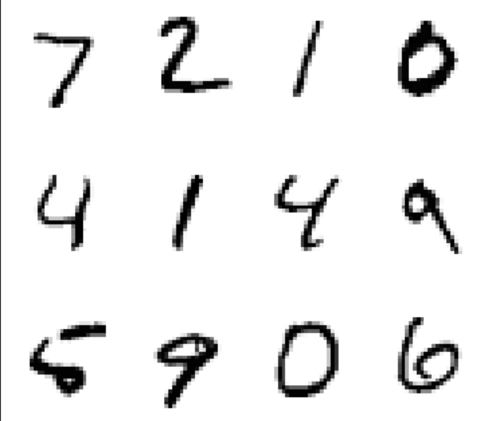

## 問題文

損失関数としてよく用いられる交差エントロピー誤差 $E$ を実装してみましょう。
以下のような手書き文字の画像に対して、何の数字を表しているかを分類する際の損失を計算することを考えます。

<figure>
    
    <figcaption>手書きの数字の画像(MNIST)  </figcaption>
</figure>

手書きの数字の画像(MNIST) [出典[1]](#出典)


数字 $L \in \{0, 1, \cdots, 9\}$ の手書き文字の画像が入力されると、モデルは
<div style="text-align:center">

$\hat{y}_k :=$ 手書き文字の画像が $k$ である確率の推定値

</div>

と定義される $\hat{\bm{y}} \in \mathbb{R}^{10}$ を出力します。
また以下で定義されるOne-Hot表現と呼ばれる形式で正解ラベル $\bm{t}$ が与えられます。<br>
$\bm{t}$ の第 $k$ 成分を $t_k$ と書くと，
$$
t_k = \left\{
    \begin{array}{ll}
        1 & (k = L) \\
        0 & (k \neq L)
\end{array}
\right.
$$

例えば、 $L = 3$ のとき $\bm{t} = (0, 0, 0, 1, 0, 0, 0, 0, 0, 0)$ と与えられます。
$\hat{\bm{y}}$ の第 $k$ 成分を $\hat{y}_k$ とすると、交差エントロピー誤差 $E$ は次のように定義されます。

$$
\begin{align*}
E := - \displaystyle\sum_{k} t_k \log \hat{y}_{k}
\end{align*}
$$

今、$N$ 枚のデータがあります。 $n$ 枚目に対するモデルの出力を $\hat{\bm{y}}_n$ 、正解ラベルを $\bm{t}_n$ とします。
さらにこれらのベクトルの第 $k$ 成分をそれぞれ $\hat{y}_{n, k}, \;t_{n, k}$ とします。
$N$ 個の出力に対する $E$ の平均値を求めてください。

## 制約

- $1 \leq N \leq 10^3 \\$
- $0 < y_{n, k} \leq 1 \quad (0 \leq n \leq N - 1,\; 0 \leq k \leq9)$
- $t_{n, k} \in \{0, 1\} \quad (0 \leq n \leq N - 1,\; 0 \leq k \leq9)$
## 入力
$
N
\newline
\begin{matrix}
    \hat{y}_{0, 0} & \hat{y}_{0, 1} & \cdots & \hat{y}_{0, 9} \\
    \hat{y}_{1, 0} & \hat{y}_{1, 1} & \cdots & \hat{y}_{1, 9} \\
    \vdots & & \ddots& \vdots \\
    \hat{y}_{N-1, 0} & \hat{y}_{N-1, 1} & \cdots & \hat{y}_{N-1, 9} \\
\end{matrix}
\newline
\begin{matrix}
    t_{0, 0} & t_{0, 1} & \cdots & t_{0, 9} \\
    t_{1, 0} & t_{1, 1} & \cdots & t_{1, 9} \\
    \vdots & & \ddots& \vdots \\
    t_{N-1, 0} & t_{N-1, 1} & \cdots & t_{N-1, 9} \\
\end{matrix}
$

- $y_{n, k}$ は指数表記されていますが(例えば`1.32731179e-05`など)、`float()`で`float`型に変換可能です。

##  出力
$E$ の平均値を出力してください。 ただし、想定解との絶対誤差または相対誤差が $10^{-2}$ 未満であれば正解となります。 

## 入力例1
```
2
3.88137874e-05 1.19893002e-03 1.71126364e-02 8.66836255e-04 1.80641238e-02 7.02557158e-03 9.52048605e-01 7.03873548e-06 3.41195716e-03 2.25487577e-04
3.72967936e-04 1.51329534e-03 2.89353174e-02 1.43250775e-02 1.47817431e-02 8.96805085e-02 2.21424111e-02 3.22788149e-05 8.26345469e-01 1.87093094e-03
0 0 0 0 0 0 1 0 0 0
0 0 0 0 0 0 0 0 1 0
```
## 出力例1
```
0.11994076969046022
```
## 入力例2
```
5
1.32731179e-05 7.26441857e-06 7.54565630e-06 3.19469141e-04 1.23291480e-05 5.45031387e-05 3.23382786e-08 9.95737021e-01 2.88223056e-05 3.81973954e-03
3.58326312e-04 2.97234428e-04 2.93960857e-04 9.38661808e-01 6.30665607e-05 5.45889223e-02 2.08287889e-05 7.99905760e-04 3.48081882e-03 1.43512796e-03
1.88162275e-02 7.85529453e-05 1.98336174e-03 1.26036410e-04 7.05466118e-01 4.98869602e-02 4.09615942e-02 2.99521996e-02 9.72076687e-03 1.43008182e-01
7.67553856e-05 4.06543750e-05 4.05313916e-05 1.78092513e-04 3.08196836e-04 3.13621788e-04 1.70804831e-06 9.77818623e-01 9.68501124e-05 2.11249666e-02
6.03934447e-03 1.97768952e-04 2.70614186e-02 3.86345158e-04 8.37716150e-02 7.01265587e-03 8.68629813e-01 9.92477879e-04 4.02936779e-03 1.87919345e-03
0 0 0 0 0 0 0 1 0 0
0 0 0 1 0 0 0 0 0 0
0 0 0 0 1 0 0 0 0 0
0 0 0 0 0 0 0 1 0 0
0 0 0 0 0 0 1 0 0 0
```
## 出力例2
```
0.11594759438072283
```

## 補足
ニューラルネットの学習では複数枚をまとめて学習するミニバッチ学習を行う場合が多く、このときの損失関数はこの問題のように各出力に対する $E$ の平均を損失関数とします。

## 出典
[1] tensorflow.keras.datasetsのmnistデータセットから作成(TensorFlowのバージョンは2.15.0)
https://storage.googleapis.com/tensorflow/tf-keras-datasets/mnist.npz
